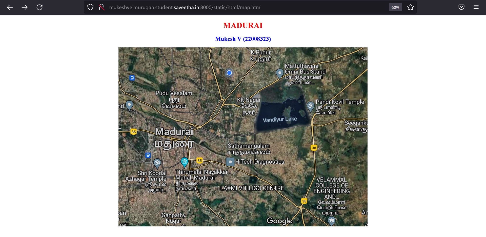
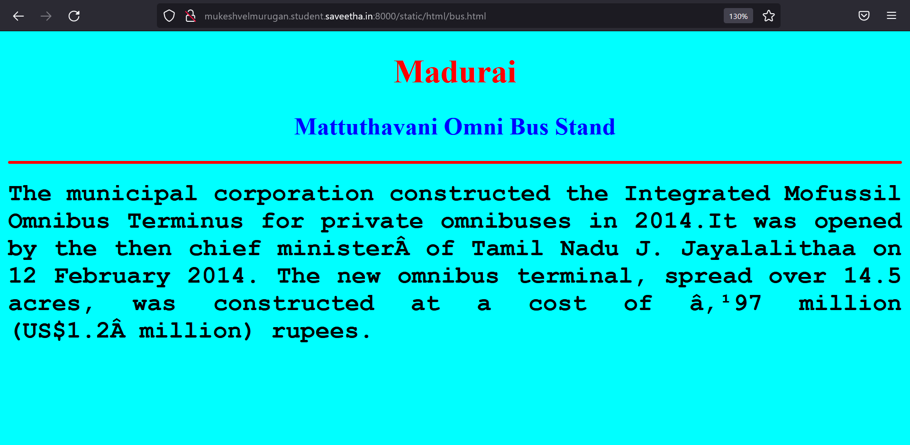
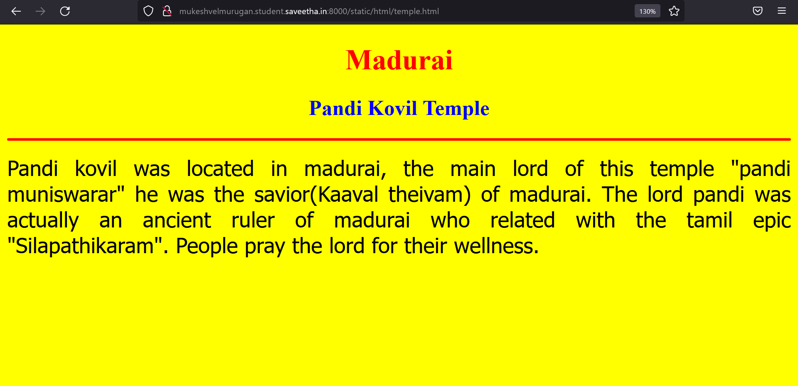
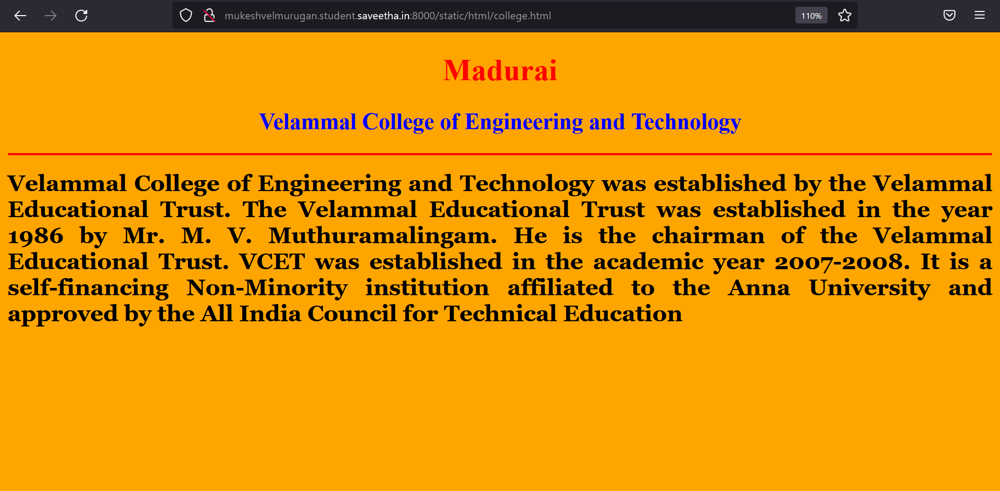
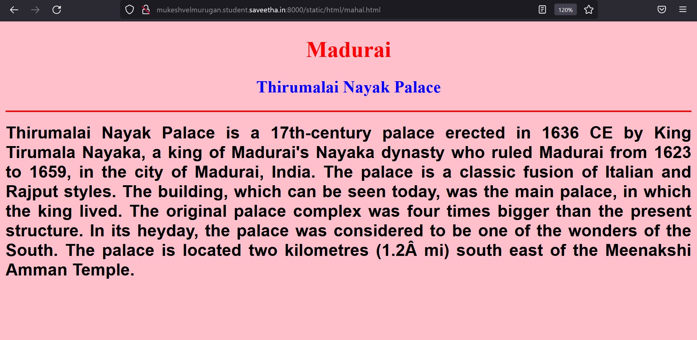
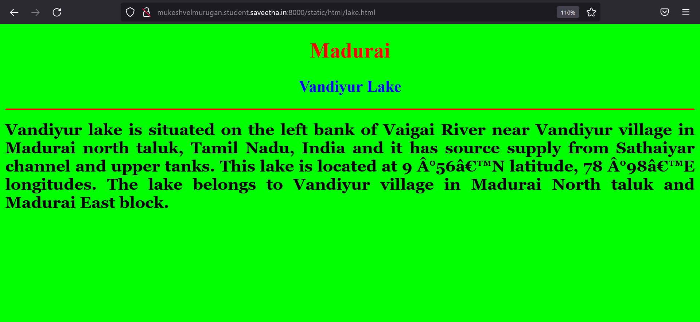
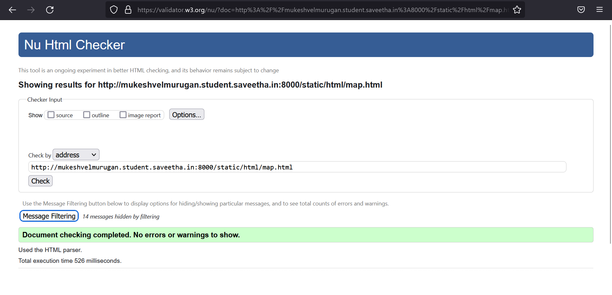

# Places Around Me
## AIM:
To develop a website to display details about the places around my house.

## Design Steps:

### Step 1:
Clone the github repository into Theia IDE.
### Step 2:
Create a new Django project.
### Step 3:
Write the needed HTML code.
### Step 4:
Run the Django server and execute the HTMLfiles.
## Code:
```
map.html

<!DOCTYPE html>
<html lang="en">
<head>
<title>MyCity</title>
</head>
<body>
<h1 align="center">
<font color="red"><b>MADURAI</b></font>
</h1>
<h2 align="center">
<font color="blue"><b>Mukesh V (22008323)</b></font>
</h2>
<center>

<map name="MyCity">
<area shape="circle" coords="400,200,20" href="/static/html/temple.html" title="temple">
<area shape="rectangle" coords="230,30,260,60" href="/static/html/bus.html" title="Bus Stand">
<area shape="circle" coords="400,350,50" href="/static/html/college.html" title="college">
<area shape="circle" coords="490,500,75" href="/static/html/lake.html" title="Vandiyur Lake">
<area shape="rectangle" coords="490,150,870,320" href="/static/html/mahal.html" title="palace">
</map>
</center>
</body>
</html>

bus.html

<!DOCTYPE html>
<html lang="en">
<head>
<title>Bus Stand</title>
</head>
<body bgcolor="cyan">
<h1 align="center">
<font color="red"><b>Madurai</b></font>
</h1>
<h2 align="center">
<font color="blue"><b>Mattuthavani Omni Bus Stand</b></font>
</h2>
<hr size="3" color="red">
<p align="justify">
<font face="Courier New" size="5">
<b>The municipal corporation constructed the Integrated Mofussil Omnibus Terminus for private omnibuses in 2014.It was opened by the then chief minister of Tamil Nadu J. Jayalalithaa on 12 February 2014. The new omnibus terminal, spread over 14.5 acres, was constructed at a cost of ₹97 million (US$1.2 million) rupees.
</b>
</font>
</p>
</body>
</html>

college.html

<!DOCTYPE html>
<html lang="en">
<head>
<title>college</title>
</head>
<body bgcolor="orange">
<h1 align="center">
<font color="red"><b>Madurai</b></font>
</h1>
<h2 align="center">
<font color="blue"><b>Velammal College of Engineering and Technology</b></font>
</h2>
<hr size="3" color="red">
<p align="justify">
<font face="Georgia" size="5">
<b>
    Velammal College of Engineering and Technology was established by the Velammal Educational Trust. The Velammal Educational Trust was established in the year 1986 by Mr. M. V. Muthuramalingam. He is the chairman of the Velammal Educational Trust.

VCET was established in the academic year 2007-2008. It is a self-financing Non-Minority institution affiliated to the Anna University and approved by the All India Council for Technical Education
</b>
</font>
</p>
</body>
</html>

mahal.html

<!DOCTYPE html>
<html lang="en">
<head>
<title>palace</title>
</head>
<body bgcolor="pink">
<h1 align="center">
<font color="red"><b>Madurai</b></font>
</h1>
<h2 align="center">
<font color="blue"><b>Thirumalai Nayak Palace</b></font>
</h2>
<hr size="3" color="red">
<p align="justify">
<font face="Arial" size="5">
<b>
    Thirumalai Nayak Palace is a 17th-century palace erected in 1636 CE by King Tirumala Nayaka, a king of Madurai's Nayaka dynasty who ruled Madurai from 1623 to 1659, in the city of Madurai, India. The palace is a classic fusion of Italian and Rajput styles. The building, which can be seen today, was the main palace, in which the king lived. The original palace complex was four times bigger than the present structure. In its heyday, the palace was considered to be one of the wonders of the South. The palace is located two kilometres (1.2 mi) south east of the Meenakshi Amman Temple. 
</b>

</font>
</p>
</body>
</html>

lake.html

<!DOCTYPE html>
<html lang="en">
<head>
<title>Vandiyur Lake</title>
</head>
<body bgcolor="lime">
<h1 align="center">
<font color="red"><b>Madurai</b></font>
</h1>
<h2 align="center">
<font color="blue"><b>Vandiyur Lake</b></font>
</h2>
<hr size="3" color="red">
<p align="justify">
<font face="Georgia" size="5">
<b>Vandiyur lake is situated on the left bank of Vaigai River near Vandiyur village in Madurai north taluk,
Tamil Nadu, India and it has source supply from Sathaiyar channel and upper tanks. This lake is located at
9 °56’N latitude, 78 °98’E longitudes. The lake belongs to Vandiyur village in Madurai North taluk and
Madurai East block.
</b>
</font>
</p>
</body>
</html>

temple.html

<!DOCTYPE html>
<html lang="en">
<head>
<title>temple</title>
</head>
<body bgcolor="yellow">
<h1 align="center">
<font color="red"><b>Madurai</b></font>
</h1>
<h2 align="center">
<font color="blue"><b>Pandi Kovil Temple</b></font>
</h2>
<hr size="3" color="red">
<p align="justify">
<font face="Tahoma" size="5">
Pandi kovil was located in madurai, the main lord of this temple "pandi muniswarar" he was the savior(Kaaval theivam) of madurai. The lord pandi was actually an ancient ruler of madurai who related with the tamil epic "Silapathikaram". People pray the lord for their wellness. 
</font>
</p>
</body>
</html>
```

## Output:







## HTML Validator:



## Result:
The program for implementation image map is executed successfully.